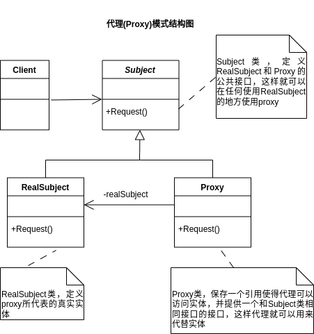
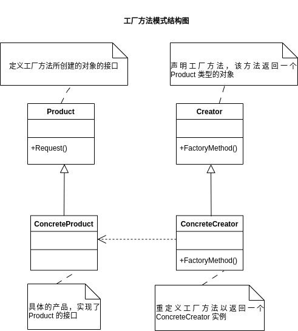
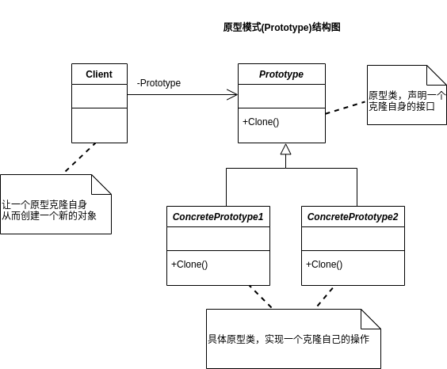

# 设计模式
面向对象编程优点：
可维护
可复用
可扩展
灵活性好
面向对象三大特性：封装、继承、多态降低程序的耦合度
业务逻辑和界面逻辑分开降低两者间度耦合度
## 简单工厂模式
用一个单独的类来创造实例的过程，这个类就是简单工厂类。
**UML类图**

UML类图是一种强大的工具，可用于可视化和传达软件系统的结构和关系。
- 类图分三层：

|类名(抽象类用斜体)|
|---|
|类的特性(通常是字段和属性)|
|类的操作(通常是方法和行为)|

注意: '+' 表示 pubilc, '-' 表示 private, '#' 表示 protected。
- 接口图
与类图区别在于顶端有 << interface >>显示。

|<< interface >> 接口名称|
|:---:|
|接口方法|

还有一种表示方法叫做棒棒糖表示法。
1. 继承关系用空三角 + 实线来表示。
2. 实现接口用空三角 + 虚线来表示。
3. 关联关系用实线箭头表示。
4. 聚合 : 表示一种弱的”拥有“关系，体现的是 A 对象可以包含 B 对象，但 B 对象不是 A 对象的一部分。空心菱形 + 实心箭头表示。
5. 合成(组合) : 是一种强的"拥有"关系，体现了严格的部分与整体关系，部分和整体的生命周期一样。实心菱形 + 实心箭头表示。合成关系两端各有一个基数表示该端可以有几个实例。
6. 依赖关系用虚线箭头表示。
## 策略模式
它定义了一个算法家族，分别封装起来，让它们之间可以相互替换，此模式让算法的变化，不会影响到使用算法到用户。
它允许在运行时选择算法的行为，而不是在编译时固定使用特定算法。该模式属于行为型设计模式，它通过将一组算法封装在可互换的策略对象中，以使算法的选择和使用与客户端代码解耦。
***策略模式到核心是实现算法的封装***
## 单一职责原则(SRP)
 - 就一个类而言，应该仅有一个引起它变化的原因。
 - 如果一个类承担的职责过多，就等于把这些职责耦合在了一起，一个职责的变化可能会削弱或抑制这个类完成其他职责的能力。这种耦合会导致脆弱的设计，当变化发生时，设计会遭到意想不到当破坏。
 - 软件设计真正要做的许多内容，就是发现职责并把那些职责相互分离。
 - 如果你能想到多于一个动机去改变一个类，那么这个类就具有多于一个职责，就应该考虑类的职责分离。
## 开放-封闭原则(开-闭原则，OCP)
- 开放-封闭原则，是说软件实体(类、模板、函数等等)应该可以扩展，但是不可修改。即，对于扩展是开放的，对于更改是封闭的。
- 无论模块是多么"封闭"，都会存在一些无法对之封闭的变化。既然不可能完全封闭，设计人员必须对于他设计的模块应该对哪种变化封闭做出选择。他必须猜测出最有可能发生的变化种类(这种方式不太现实)，然后构造抽象来隔离那些变化。
- 在我们最初编写代码时，假设变化不发生。当变化发生时，我们就创建抽象来隔离以后发生同类的变化。
- 面对需求，对程序的改动是通过增加新代码进行的，而不是更改现有的代码。
- 查明可能发生的变化所等待的时间越长，要创建正确的抽象就越困难。
- 开放-封闭原则是面向对象设计的核心所在。遵循这个原则可以带来面向对象技术所声称的巨大好处，也就是可维护、可扩展、可复用、灵活性好。开发人员应该仅对程序中呈现出频繁变化的那部分做出抽象，然而，对于应用程序中的每个部分都时刻地进行抽象同样不是一个好主意。拒绝不成熟地抽象和抽象本身一样重要。
## 依赖倒转原则

- 依赖倒转原则：
>1. 高层模块不应该依赖低层模块。两个都应该依赖抽象。
>2. 抽象不应该依赖细节。细节应该依赖抽象。

- 抽象不应该依赖细节，细节应该依赖于抽象。即应针对接口编程，不应该对实现编程。
## 里氏代换原则(LSP)

>- 里氏代换原则:子类型必须能够替换掉它的父类型。即，在软件里面，把父类都替换称它的子类，程序行为没有变化。
>- 只有当子类可以替换掉父类，软件单位的功能不受影响时，父类才能真正被复用，而子类也能够在父类基础上增加新的行为。

- 依赖倒转其实可以说是面向对象设计的标志，用哪些语言来编写程序不重要，如果编写时考虑的都是如何针对抽象编程而不是细节编程，即程序中所有的依赖关系都是终止于抽象类或者接口，那就是面向对象设计，反之那就是过程设计。
## 装饰模式
- **装饰模式(Decorator)**: 动态地给一个对象添加额外的职责，就增加功能来说，装饰模式比生成子类更灵活。
- 装饰模式是利用 SetComponent 来对对象进行包装。
- 每个装饰对象和如何使用这个对象分离，每个装饰对象只关心自己的功能，不需要关心如何添加到对象链当中。
- 装饰模式，把每个要装饰到功能放在单独的类中，并让这个类包装它所要装饰的对象，因此，当需要执行特殊行为时，客户代码就可以在运行时根据需求有选择地、按顺序地使用装饰功能包装对象了。
- 如果只有一个 ConcreteComponent 类而没有抽象的 Component 类，那么 Decorator 类可以是 ConcreteComponent 的一个子类。同样道理，如果只有一个 ConcreteDecorator 类，那么没必要建立一个单独 Decorator 类，可以把 Decorator 和 ConcreteDecorator 的责任合并为一个类。
- 装饰模式的优点:
>- 把类中的装饰功能从类中搬移去除，这样可以简化原有的类。
>- 把核心职责和装饰功能分开来，而且可以去除相关类中重复的装饰逻辑。
- ***装饰模式的装饰顺序很重要***。
## 代理模式
- **代理模式(Proxy)**，为其他对象提供一种代理以控制对这个对象的访问。

- 代理模式应用
1. 远程代理
为一个对象在不同的地址空间提供局部代表。这样可以隐藏一个对象存在于不同地址空间的事实。如 webservice
2. 虚拟代理
根据需要创建开销很大的对象。通过它来存放实例化需要很长时间的真实对象。如 HTML
3. 安全代理
用来控制真实对象访问时的权限。
4. 智能指引
当调用真实对象时，代理处理另外一些事。
- 代理模式就是在访问对象时引入一定程度的间接性，因为这种间接性，可以附加多种用途。
## 工厂方法模式
- 简单工厂 VS 工厂方法模式
简单工厂模式最大的优点在于工厂类中包含了必要的逻辑判断，根据客户端的选择条件动态实例化相关类，对于客户端来说，去除类与具体产品的依赖。
- **工厂方法模式**: 定义一个用于创建对象的接口，让子类决定实例化哪一个类。工厂方法使一个类的实例化延迟到其子类。
- 工厂方法模式结构图

## 原型模式
- 原型模式(Prototype),用原型实例指定创建对象的种类，并且通过拷贝这些原型创建新的对象。
**c++11新特性，协变返回类型**
- 原型模式结构图：

## 模板方法模式
- 当我们要完成在某一细节层次一致一个过程或一系列步骤，但其个别步骤在更详细的层次上实现可能不同时，我们通常考虑使用模板方法模式处理。

**模板方法模式**：定义一个操作中的算法骨架，而将一些步骤延迟到子类中。模板方法使得子类可以不改变一个算法结构即可重新定义该算法到某些特定步骤。
- 模板方法模式

## 迪米特法则(LoD)

迪米特法则(LoD): 
> 如果两个类不必彼此直接通信，那么这两个类就不应当发生直接的相互作用。如果其中一个类需要调用另一个类某一个方法的话，可以通过第三者转发这个调用。

- 在类的结构设计中，每一个类都应当尽量降低成员的访问权限。
- 迪米特法则的根本思想，是强调类之间的松耦合。
- 类之间的耦合越弱，越有利于复用，一个处于弱耦合的类被修改，不会对有关系的造成波及。
## 外观模式(Facade)

**外观模式(Facade)**: 为子系统中的一组接口提供一个一致的界面，此模式定义了一个高层接口，这个接口使得这一子系统更加容易使用。
外观模式结构图

- 在设计初期阶段，应该要有意识的将不同的两个层分离，层与层之间建立外观 **Facade**。
- 在开发阶段，子系统往往经过不断的重构演化而变得越来越复杂，增加外观 **Facade** 可以提供一个简单的接口，减少它们之间的依赖。
- 在维护一个遗留的大型系统时，可能这个系统已经非常难以维护和扩展了，为新系统开发一个外观 **Facade** 类，来提供设计粗糙或高度复杂的遗留代码的比较清晰简单的接口，让新系统与 **Facade** 对象交互，**Facade** 与遗留代码交互所有复杂的工作。
- **外观模式**体现了**依赖倒置原则**和**迪米特法则**。
## 建造者模式(Builder)

**建造者模式(Builder)**: 将一个复杂对象的构建与它的表示分离，使得同样的构建过程可以创建不同的表示。

建造者模式结构：

- 建造者模式用于创建一些复杂的对象，这些对象内部构建间的建造顺序通常是稳定的，但对象内部的构建通常面临着复杂变化。
- 建造者模式，使得建造代码与表示代码分离，由于建造者隐藏了该产品是如何组装的，所以若要改变一个产品的内部表示，只需要再定义一个建造者即可。
- 建造者模式是在当创建复杂对象的**算法**应该独立于该对象的**组成部分**以及它们的**装配方式**时适用的模式。
## 观察者模式(Observer)

**观察者模式(Observer)** 又叫 **发布-订阅(Publish/Subscribe)模式**。
**观察者模式(Observer)**：定义了一种一对多的依赖关系，让多个观察者对象同时监听某一个主题对象。这个主题对象(抽象通知者)在状态发生变化时，会通知所有观察者对象，使它们能够自动更新自己。

观察者模式结构：

- 动机：
> 将一个系统分割成一系列相互协作的类有一个很不好的副作用，那就是需要要维护相关对象的一致性。我们不希望为了维持一致性而使各类紧密耦合，这样会给维护、扩展和重用带来不便。
- 应用场景：
> 当一个对象改变需要同时改变其他对象，而它不知道具体有多少对象有待改变，应该使用观察者模式。
- 一个抽象模型有两个方面，其中一个方面依赖于另一个方面，这时用观察者模式可以将这两者封装在独立的中使它们各自独立的改变和复用。
- 观察者模式所做的工作其实就是在解除耦合。让耦合双方都依赖于抽象，而不是依赖于具体。从而使得各自的变化都不会影响到另一边的变化。
- **事件委托实现**

事件委托产生的动机：
> 现实中，"抽象通知者"由于不希望依赖"抽象观察者"，所以"增加"和"减少"的方法就没必要了(即抽象观察者已经不存在了)。

- 委托就是一种引用方法的类型。一旦为委托分配了方法，委托将与该方法具有完全相同的行为。委托方法的使用可以像其他任何方法一样，具有参数和返回值。委托可以看作是对函数的抽象，是函数的"类"，委托的实例代表一个具体的函数。
- 一个委托可以搭载多个方法，所有方法被依次唤起。它可以使委托对象所搭载的方法并不需要属于同一个类。
- 委托对象所搭载的所有方法必须具有相同的原形和形式，也就是**具有相同的参数列表和放回值类型**。

## 抽象工厂方法(Abstract Factory)

**抽象工厂方法(Abstract Factory)**：提供一个创建一系列相关或相互依赖对象的接口，而无需指定它们具体的类。
抽象工厂方法结构：

- 抽象工厂的优缺点

优点：
> 易于交换产品系列，由于具体工厂类在一个应用中只需要在初始化的时候出现一次，这就使得改变一个应用的具体工厂变得非常容易，它只需要改变具体工厂即可使用不同的产品配置。
> 它让具体的创建实现过程与客户端分离，客户端是通过它们的抽象接口操作实例，产品的具体类名也被具体工厂的实现分离，不会出现在客户代码中。

缺点：
> 如果需求来自增加功能，则需要改变的类较多。

- 简单工厂改进抽象工厂
- 用反射加抽象工厂
- 编程方式：依赖注入(Dependency Injection)
- 反射技术使用格式：Assembly.Load("程序集名称").CreateInstance("命名空间.类型名称")
- 所有用简单工厂的地方，都可以考虑用反射技术来去除 switch 或 if，解除分支判断带来的耦合。
## 状态模式(State)
**状态模式(State)**：当一个对象的内在状态改变时允许改变其行为，这个对象看起来像似改变了其类。
- 状态模式主要**解决**的是当控制一个对象状态转换的条件表达式过于复杂时的情况。把状态的判断逻辑转移到表示不同状态的一系列类当中，可以把复杂的判断逻辑简化。
状态模式结构：

状态模式好处：
> 将与特定状态相关的行为局部化，并且将不同状态的行为分割开来。
> 将特定的状态相关的行为都放入一个对象中，由于所有与状态相关的代码都存在某个 ConcreteState 中，所以通过定义新的子类可以很容易的增加新的状态和转换。
> 消除了庞大的条件分支语句。状态模式通过把各种状态转移逻辑分布到 State 的子类中,来减少相互间的依赖。
> 当一个对象的行为取决于它的状态，并且它必须在运行时刻根据状态改变它的行为时，就可以考虑使用状态模式。

## 适配器模式(Adapter)
**适配器模式(Adapter)**：将一个类的接口转换成客户希望的另外一个接口。适配器模式使得原本由于接口不兼容而不能一起工作的那些类可以一起工作。
- 当系统的数据和行为都正确，但接口不符合，我们应该考虑用适配器，目的是使控制范围之外的一个原有对象与某个接口匹配。
- 适配器模式主要应用于希望复用一些现存的类，但是接口又与复用环境要求不一致的情况。
- 适配器模式分为：类适配器模式和对象适配器模式。
> 类适配器：通过多重继承对一个接口与另一个接口进行匹配。**(C#、Java、VB.Net不支持多重继承,即它们要求一个类只有一个父类)**

对象适配器结构：

- 使用一个已经存在的类，但如果它的接口，也就是它的方法和你的要求不同时，应该考虑用适配器模式。
- 两个类所做的事情相同或相似，但是具有不同的接口时要使用它。
- 客户代码可以统一调用同一接口，可以更简单、更直接、更紧凑。
- 在双方都不太容易修改的时候，再使用适配器模式适配。而不是一有不同就使用它。
## 备忘录模式(Memento)
**备忘录模式(Memento)**：在不破坏封装性的前提下，捕捉一个对象的内部状态，并在该对象之外保存这个状态。这样就可以将该对象恢复到原先保存的状态。
备忘录模式结构：

- Memento 模式比较适用于功能比较复杂的，但需要维护或记录属性历史的类，需要保存的属性只是众多属性中的一小部分时，Originator 可以根据保存的 Memento 信息还原到前一状态。
- 如果在某个系统中使用**命令模式**时，需要实现命令的撤销功能，那么命令模式可以使用备忘录模式来存储可撤销操作的状态。
- 使用备忘录可以复杂的对象内部信息对其他的对象屏蔽起来。
- 当角色的状态改变的时候，有可能这个状态无效，这个时候就可以时候暂时保存起来的备忘录将状态复原。
## 组合模式(Composite)
**组合模式(Composite)**：将对象组合成树形结构以表示"部分-整体"的层次结构。组合模式使得用户对单个对象和组合对象的使用具有一致性。
组合模式结构：

- 透明方式与安全方式
> 透明方式：在 Component 中声明所有用来管理子对象的方法，其中包括 Remove,Add 等。这样实现的 Component 接口的所有子类都具备了 Add 和 Remove。这样做的好处就是叶节点和枝节点对于外界没有区别，它们具备完全一致的行为接口。缺点，Leaf 类本身不具备 Add 和 Remove 方法的功能，实现它没有意义。
> 安全方式：在 Component 中不去声明 Remove,Add 方法，那么子类 Leaf 也就不需要去实现它，而是在 Composite 声明所有用来管理子类对象的方法，由于不够透明，所以树叶和树枝类将不具备相同的接口，客户端调用需要做相应的判断，带来不便。

- 需求中是体现部分与整体层次结构时，以及你希望用户可以忽略组合对象与单个对象的不同，统一地使用组合结构中的所有对象时，就应该考虑使用组合模式。
- 组合模式包含基本对象和组合对象的类层次结构。基本对象可以被组合成更复杂的组合对象，而这个组合对象又可以被组合，这样不断的递归下去，客户代码中，任何用到基本对象的地方都可以使用组合对象。
- 用户不需要关心到底是处理一个叶节点还是一个组合组件，也就用不着为定义组合而写一些选择判断语句了。
- 组合模式让客户可以一致地使用组合结构和单个对象。
## 迭代器模式(Iterator)
**迭代器模式(Iterator)**：提供一种方法顺序访问一个聚合对象中每个元素，而又不暴露该对象的内部表示。
- 当你访问一个聚合对象，而且不管这些对象是什么都需要遍历的时候，你就应该考虑用迭代器模式。
- 你需要对聚集有多种方式遍历时，可以考虑用迭代器模式。
- 迭代器模式为遍历不同的聚集结构提供如开始、下一个、是否结束、当前哪一项等统一的接口。(c# Java等已经将该模式集成在语言内部了，**foreach 算法**)
迭代器模式结构：

- 迭代器模式就是分离了集合对象的遍历行为，抽象出一个迭代器类来负责，这样既可以做到不暴露集合内部结构，又可让外部代码透明的访问集合内部的数据。
## 单例模式(Singleton)
**单例模式(Singleton)**：保证一个类仅有一个实例，并提供一个访问它的全局访问点。
- 所有类都有构造方法，不编码则系统默认生成空的构造方法，若有显示定义的构造方法，默认构造方法就会消失。
- 通常我们可以让一个全局变量使得一个对象被访问，但它不能防止你实例化多个对象。一个最好的办法就是，让类自身负责保存它的唯一实例。这个类可以保证没有其他实例可以被创建，并且它可以提供一个访问该实例的方法。
单例模式结构：

- 单例模式因为 Singleton 封装它的唯一实例，这样它可以严格地控制客户怎样访问它以及何时访问它。简单地说就是对唯一实例的受控访问。
- 多线程时的单例模式，通常会加进程锁 lock，lock 是确保当一个线程位于代码的临界区时，另一个线程不进入临界区。如果其他线程试图进入锁定的代码，则它将一直等待，直到对象被释放。
- 静态初始化的方式在自己被加载时就将自己实例化，称之为饿汉式单例类。不存在多线程安全问题。
- 要在第一次被引用时，才会将自己实例化，称之为懒汉式单例类。存在多线程安全问题。
## 合成/聚合复用原则
- 对象的继承关系是在编译时就定义好的了，所以无法在运行时改变从父类继承的实现。子类的实现与它的父类有非常紧密的依赖关系，以至于父类实现中的任何变化必然会导致子类发生变化。当你需要复用子类时，如果继承下来的实现不适合解决新的问题，则父类必须重写或被其他更适合的类替换。这种依赖关系限制了灵活性并最终限制了复用性。
**合成/聚合复用原则(CARP)**：尽量使用合成/聚合，尽量不要使用类继承。
 **聚合** : 表示一种弱的”拥有“关系，体现的是 A 对象可以包含 B 对象，但 B 对象不是 A 对象的一部分。
 **合成** : 是一种强的"拥有"关系，体现了严格的部分与整体关系，部分和整体的生命周期一样。
 - 优先使用对象的合成/聚合将有助于你保持每个类被封装，并被集中在单个任务上。这样类和类继承层次会保持较小规模，并且不太可能增长为不可控的庞然大物。
## 桥接模式(Bridge)
**桥接模式(Bridge)**：将抽象部分与它的实现部分分离，使它们都可以独立地变化。
- 抽象与它的实现分离，不是让抽象类与其派生类分离，因为这没有意思。实现指的是抽象类和它的派生类用来实现自己的对象。
桥接模式结构：

- 实现系统可能有多角度分类，每一种分类都有可能变化，那么就把这种多角度分离出来让它们独立变化，减少它们之间的耦合。
## 命令模式(Command)
**命令模式(Command)**：将一个请求封装为一个对象，从而使你可用不同的请求对客户进行参数化；对请求排队或记录请求日志，以及支持可撤销的操作。
命令模式结构：

invoke:调用
- 命令模式作用
>1. 它能较容易地设计一个命令队列
>2. 在需要的情况下，可以较容易地将命令记录日志
>3. 允许接收请求的一方决定是否要否决请求
>4. 可以容易地实现对请求的撤销和重做
>5. 由于加进新的具体命令类不影响其他类，因此增加新的具体命令类很容易
>- 命令模式把请求一个操作的对象与知道怎么执行一个操作的对象分割开
- 敏捷开发原则告诉我们，不要为代码添加基于猜测的、实际不需要的功能。如果不清楚一个系统是否需要命令模式，一般就不要急于去实现它，事实上，在需要的时候通过重构实现这个模式并不困难，只有在真正需要如撤销/恢复操作等功能时，把原来的代码重构为命令模式才有意义。
## 职责链模式(Chain of Responsibility)
**职责链模式(Chain of Responsibility)**：使多个对象都有机会处理请求，从而避免请求的发送者和接收者之间的耦合关系。将这个对象连成一条链，并沿着这条链传递请求，直到有一个对象处理它为止。
职责链模式结构：

- 职责链的好处
>- 当客户提交一个请求时，请求是沿链传递直至有一个 ConcreteHandler 对象负责处理它。
>- 接收者和发送者都没有对方的明确信息，且链中的对象自己也并不知道链的结构。结果是职责链可简化对象的相互连接，它们仅需保持一个指向其后继者的引用，而不需保持它所有的候选接收者的引用。
>- 随时地增加或修改处理一个请求的结构，增强了给对象指派职责的灵活性。
- 一个请求极有可能到了链的末端都得不到处理，或者因为没有正确配置而得不到处理。
## 中介者模式(Mediator)
- 尽管将一个系统分割成许多对象通常可以增加其可复用性，但是对象间相互连接的激增又会降低其可复用性。
- 大量的连接使得一个对象不可能在没有其他对象的支持下工作，系统表现为一个不可分割的整体，所以，对系统的行为进行任何较大的改动就十分困难了。
**中介者模式(Mediator)**：用一个中介对象来封装一系列的对象交互。中介者使对象不需要显式地相互引用，从而使其耦度松散，而且可以独立地改变它们之间的交互。中介者模式又叫调停者模式。
中介者模式结构：
